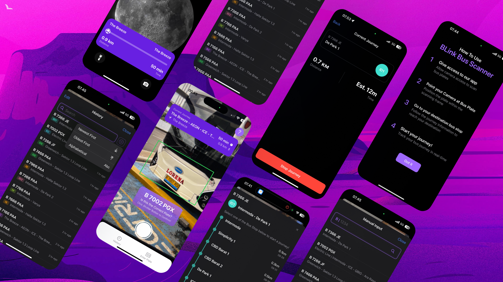

# BLinkNew 🚌




BLinkNew is an enhanced mobile application designed to help users scan bus plate numbers and instantly access route information, schedules, and navigation assistance for the BSD City bus network. It provides a seamless way to navigate public transportation with real-time information and live activity tracking.

## 🌟 Features

- **Plate Number Scanning:** Scan bus plate numbers using your device's camera with Vision Framework
- **Route Information:** View detailed route information including stations and schedules
- **Live Journey Tracking:** Track your bus journey in real-time with Live Activities and Dynamic Island support
- **Route History:** Access previously scanned buses and routes
- **Manual Input:** Manually enter plate numbers when scanning is difficult
- **Dark Mode Support:** Fully compatible with iOS dark mode
- **Offline Access:** Access previously scanned routes even without internet connection
- **Siri Integration:** Use Siri to quickly scan bus plates
- **Spotlight Search:** Find and launch the app using relevant keywords

## 🛠️ Tech Stack


- **Swift** as the programming language
- **SwiftUI** for the user interface
- **SwiftData** for local data persistence
- **Vision Framework** for plate number recognition
- **CoreLocation** for location data
- **WidgetKit** for Live Activities and Dynamic Island
- **AppIntents** for Siri and Spotlight integration

## 📋 Requirements

- iOS 17.0+
- Xcode 15.0+
- Swift 5.9+
- Active Apple Developer account (for Live Activities)

## 🚀 Installation

### Prerequisites

- Xcode 15.0 or later
- iOS 17.0 or later
- macOS Ventura or later (for development)
- Active Apple Developer account (for deployment)

### Steps

1. **Clone Repository:**

\`\`\`bash
git clone https://github.com/reynaldomarchell/BLinkNew.git
\`\`\`

2. **Open Project in Xcode:**

\`\`\`bash
cd BLinkNew
open BLinkNew.xcodeproj
\`\`\`

3. **Install Dependencies:**

The project uses Swift Package Manager for dependencies. Xcode should automatically resolve them when opening the project.

4. **Build and Run:**

Select your target device or simulator and press ⌘+R to build and run the application.

5. **Required Permissions:**

The app requires the following permissions:

- Camera access to scan bus plate numbers
- Location access for journey tracking
- Siri & Shortcuts for voice commands

## 📂 Project Structure

```plaintext
BLinkNew/
├── BLinkNew/                         # Main app target
│ ├── Activities/                     # Live Activities
│ │ ├── BusJourneyAttributes.swift
│ │ ├── BusJourneyLiveActivity.swift
│ │ └── LiveActivityManager.swift
│ ├── BLinkApp.swift                  # App entry point
│ ├── Models/ # Data models
│ │ ├── BusInfo.swift
│ │ └── BusRoute.swift
│ ├── Utils/                          # Utility classes
│ │ ├── CoreLocation.swift
│ │ ├── DataSeeder.swift
│ │ └── Extensions.swift
│ └── Views/                          # UI components
│ ├── HistoryView.swift
│ ├── HomeView.swift
│ ├── JourneyView.swift
│ ├── ManualPlateInputView.swift
│ ├── ScanResultView.swift
│ ├── SplashView.swift
│ ├── StationCard.swift
│ └── TutorialView.swift
├── BLinkWidget/                       # Widget extension
│ ├── BLinkWidgetBundle.swift
│ ├── BLinkWidgetLiveActivity.swift
│ └── ScanBusIntent.swift
└── Shared/                            # Shared code
└── SharedExtensions.swift
```

## 🧩 Key Components

### Main App

- **HomeView**: Camera interface for scanning bus plates
- **ScanResultView**: Displays route information after scanning
- **JourneyView**: Tracks and displays journey progress
- **HistoryView**: Shows previously scanned buses
- **ManualPlateInputView**: Allows manual entry of plate numbers

### Live Activities

- **BusJourneyLiveActivity**: Displays journey progress in Dynamic Island and Lock Screen
- **LiveActivityManager**: Manages the lifecycle of Live Activities

### Widget Extension

- **BLinkWidgetLiveActivity**: Widget implementation for Live Activities
- **ScanBusIntent**: AppIntent for Siri and Spotlight integration

## 🔍 Usage

1. **Home Screen:** Point your camera at a bus plate number and tap the capture button
2. **Scan Result:** View the route information for the scanned bus
3. **Start Journey:** Select a destination station and start tracking your journey
4. **Live Activity:** Monitor your journey progress via Dynamic Island or Lock Screen
5. **History:** Access your previously scanned buses
6. **Siri:** Use voice commands like "Scan a bus with BLink" to quickly open the scanner

## 🤝 Contributing

Contributions are welcome! Please feel free to submit a Pull Request.

1. Fork the repository
2. Create your feature branch (`git checkout -b feature/amazing-feature`)
3. Commit your changes (`git commit -m 'Add some amazing feature'`)
4. Push to the branch (`git push origin feature/amazing-feature`)
5. Open a Pull Request

## 📄 License

This project is licensed under the MIT License - see the LICENSE file for details.

## 🙏 Acknowledgments

- BSD City/Sinarmas Transportation Department for route information
- Apple Developer Documentation for Vision framework guidance
- SwiftUI and SwiftData community for resources and examples
- Our mentors and teams that always support us ❤️

---

> Special thanks to all the mentors and mentees that helped us achieve this, especially to Kak Luqman.

```

```
